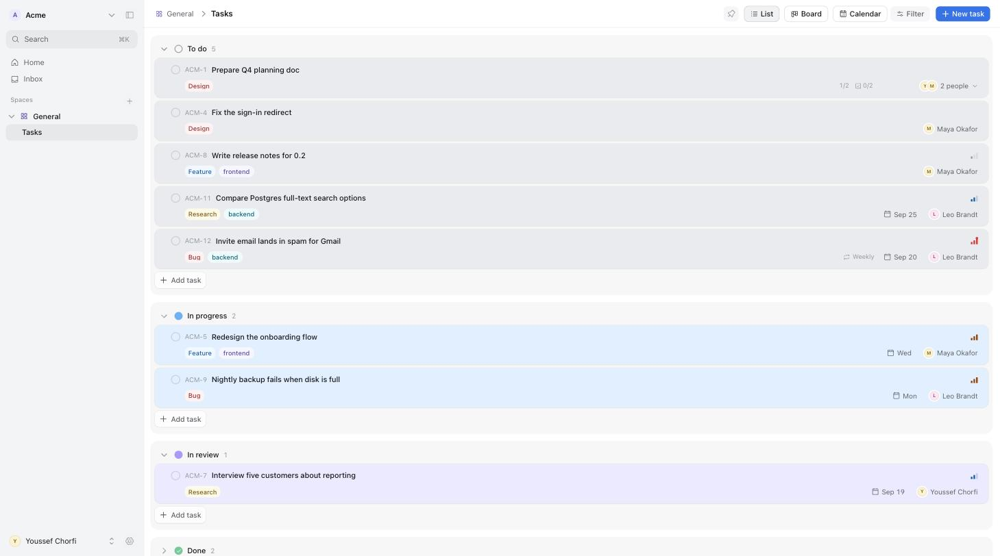
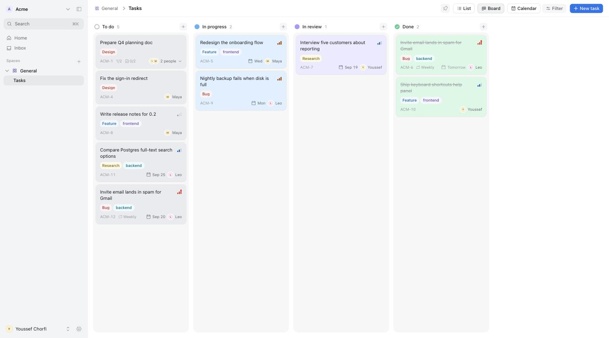
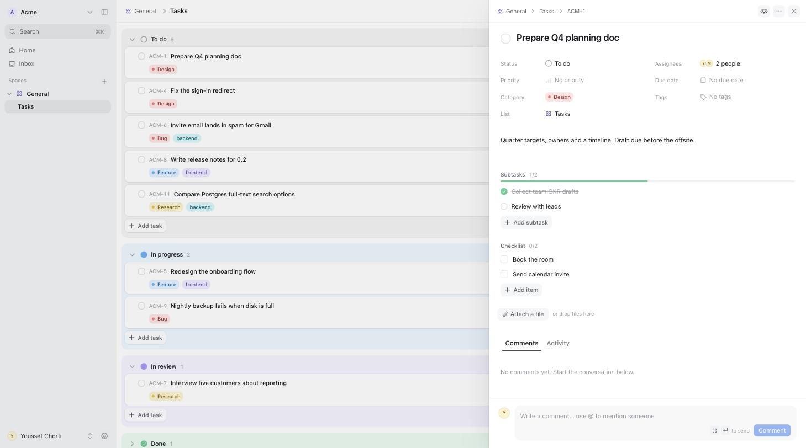
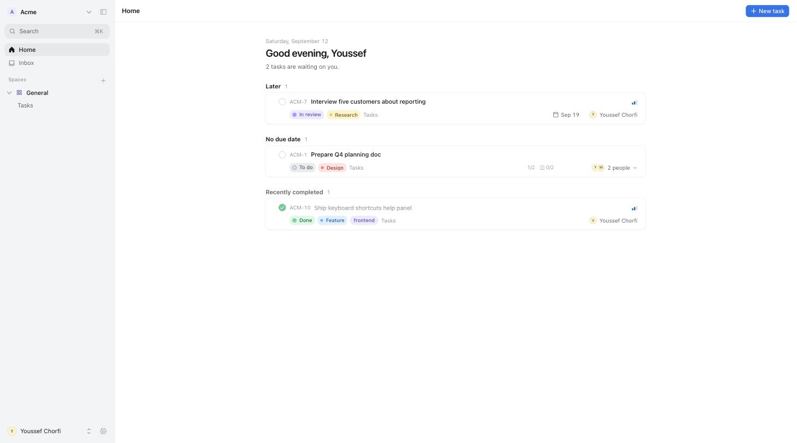

<p align="center">
  
</p>

<h1 align="center">Tandem</h1>

<p align="center">
  Free, open source project management for small teams.<br />
  Spaces, lists, tasks, boards and calendars. Self-hosted on your own server, built on open-source Supabase.
</p>

<p align="center">
  <a href="LICENSE"></a>
  <a href="https://github.com/chorfiyoussef/tandem/actions/workflows/ci.yml"></a>
</p>



Tandem is the 20% of a tool like ClickUp that a team actually uses, with none
of the noise. One flat hierarchy and one place for what's yours today.

```
Workspace  ›  Space  ›  List  ›  Task  ›  Subtask
```

## Why Tandem

- **Yours.** Runs on a single server you control. Your data is in a Postgres you can query. No seats, no plans, no vendor.
- **Everything is inline.** Change status, assignee, due date, priority, category or tags right where you see them. No edit mode, no save button.
- **Small enough to understand.** A Next.js app, a tiny API, and a set of SQL migrations. You can read the whole thing in an afternoon.
- **Built for agents too.** The conventions in `CONTRIBUTING.md` are written to be followed by AI coding tools as well as people, and the prompt below lets Claude Code set Tandem up for you.

## Features

| | |
| --- | --- |
| **Home** | Everything assigned to you, grouped by Overdue, Today, Tomorrow, This week, Later. |
| **List, Board, Calendar** | Grouped by status or category, drag to reorder or move. A calendar you can drag tasks around on. |
| **Task panel** | Title, status, assignees, priority, due date, category, tags; rich description; subtasks; checklist; attachments; comments with @mentions; activity log. |
| **Categories and tags** | One category per task for classification (Bug, Feature…), free-form tags for everything else. Filter and group by either. |
| **Inbox** | Assignments, mentions, comments on tasks you watch, status changes, daily due reminders. |
| **Realtime** | Every open view updates when a teammate changes something. |
| **Search and shortcuts** | `⌘K` palette, `C` for a new task, `G H` / `G I` to jump around. |
| **Spaces** | Their own statuses and colours; private spaces; pinned lists. |
| **Members and invites** | Owner, admin, member, guest. Invite links work with or without email. |

<table>
  <tr>
    <td></td>
    <td></td>
  </tr>
  <tr>
    <td></td>
    <td></td>
  </tr>
</table>

## What's inside

| Path | What it is |
| --- | --- |
| `apps/web` | Next.js 16 app (App Router, Tailwind v4, shadcn/ui). The whole UI. |
| `apps/api` | Small Hono (Node) service for things that need the Supabase service role: first-run setup, invites, invite sign-up, daily due-date reminders, optional email. |
| `packages/shared` | Types, zod schemas and constants shared by web and api (generated DB types live here). |
| `supabase/` | Database migrations (schema, RLS policies, triggers, RPCs) and local CLI config. |
| `infra/` | Production Docker Compose (Supabase + Tandem + Caddy), deploy scripts, backups. |

Everything the browser does goes straight to Supabase (PostgREST, Auth,
Realtime, Storage) and is protected by row-level security. The API is only
used for privileged operations.

[`CONTRIBUTING.md`](CONTRIBUTING.md) has the commands, conventions and the
gotchas we hit. Point your AI coding tool at it too.

## Local development

Prerequisites: Node 22+, pnpm (via corepack), Docker Desktop, the
[Supabase CLI](https://supabase.com/docs/guides/cli).

```bash
corepack enable && corepack prepare pnpm@10.15.0 --activate
pnpm install

# 1. Start local Supabase (Postgres, Auth, Storage, Studio…) and apply migrations
pnpm db:start
supabase status            # copy the anon key + URL into apps/web/.env.local and apps/api/.env

# 2. Run the web app and the API
pnpm dev                   # web on :3000, api on :4000
```

Copy `apps/web/.env.example` to `apps/web/.env.local` and `apps/api/.env.example`
to `apps/api/.env`; both are pre-filled for the local Supabase instance. The
first visit to http://localhost:3000 shows the **Set up Tandem** screen; create
the first account and workspace there.

Useful commands:

```bash
pnpm db:reset              # drop + re-apply migrations (wipes local data)
pnpm db:types              # regenerate packages/shared/src/database.types.ts
pnpm db:migration <name>   # create a new migration file
pnpm typecheck && pnpm lint
```

Local mail (invites, password resets) lands in Mailpit: http://127.0.0.1:54324.

## Deploying

Two pieces: the **frontend** on Cloudflare Workers, built automatically from
your fork, and the **backend** (Supabase + the Tandem API) on one Linux
server from any provider. A 2 vCPU / 4 GB box is enough for a small team.
Three hostnames:

| Hostname | Where | What |
| --- | --- | --- |
| `APP_DOMAIN`, e.g. `tandem.example.com` | Cloudflare | the Next.js app |
| `API_DOMAIN`, e.g. `api.tandem.example.com` | your server (Caddy) | the Tandem API |
| `SUPABASE_DOMAIN`, e.g. `supabase.tandem.example.com` | your server (Caddy) | Supabase API + Studio |

Prefer to skip Cloudflare? The whole thing, frontend included, can run on the
server: see "Self-hosting the frontend" below.

### 1. Backend on your server

```bash
# On the server (Ubuntu 22.04/24.04), once:
ssh root@<ip> 'bash -s' < infra/scripts/bootstrap-server.sh

# On your machine, once: create the production env with fresh secrets and copy it up
cd infra
node scripts/generate-env.mjs --app tandem.example.com --api api.tandem.example.com \
  --supabase supabase.tandem.example.com --email you@example.com
scp .env root@<ip>:/opt/tandem/infra/.env       # edit SMTP_* first if you want email

# Every backend deploy:
./infra/scripts/deploy.sh root@<ip>
```

Point the `API_DOMAIN` and `SUPABASE_DOMAIN` A records at the server. Caddy
obtains certificates on first request. `deploy.sh` rsyncs the repo, builds
the API image, starts Supabase, and applies any new migrations. The scripts
target Ubuntu 22.04/24.04 and are tested on Hetzner, but nothing in them is
provider-specific.

### 2. Frontend on Cloudflare (auto-deploys from git)

The web app is packaged for Workers with `@opennextjs/cloudflare`
(`apps/web/wrangler.jsonc`, `apps/web/open-next.config.ts`). Connect the repo
once and every push to `main` builds and deploys it; other branches get
preview URLs.

In the Cloudflare dashboard: **Workers & Pages → Create → Import a
repository** → pick `tandem`, then:

| Setting | Value |
| --- | --- |
| Project / Worker name | `tandem-web` (must match `name` in `wrangler.jsonc`) |
| Root directory | `apps/web` |
| Build command | `pnpm run build:cf` |
| Deploy command | `pnpm exec opennextjs-cloudflare deploy` |
| Build variables | `NEXT_PUBLIC_SUPABASE_URL=https://<SUPABASE_DOMAIN>`, `NEXT_PUBLIC_SUPABASE_ANON_KEY=<ANON_KEY from infra/.env>`, `NEXT_PUBLIC_API_URL=https://<API_DOMAIN>` |

`generate-env.mjs` prints these three build variables for you. Then add
`APP_DOMAIN` as a custom domain on the Worker (Settings → Domains & Routes).
That's it: `git push` = deploy.

To deploy from your laptop instead: `cd apps/web && pnpm run deploy:cf`
(needs `wrangler login`).

### Self-hosting the frontend

If you'd rather not use Cloudflare: point `APP_DOMAIN` at the server and run
`CADDYFILE=Caddyfile.with-web docker compose --profile web up -d --build` in
`/opt/tandem/infra`. See [`infra/README.md`](infra/README.md).

## Set it up with Claude Code

Tandem is written to be operated by an AI agent as much as by a person. If
you use [Claude Code](https://claude.com/claude-code), paste this prompt and
fill in the blanks; it will run Tandem locally, then deploy it and tell you
which DNS records to create:

```text
Set up Tandem (https://github.com/chorfiyoussef/tandem) for my team.

1. Clone the repo and read README.md, CONTRIBUTING.md and infra/README.md before doing anything.
2. Run it locally first (pnpm install, pnpm db:start, pnpm dev) and confirm the
   setup screen loads at http://localhost:3000.
3. Deploy it:
   - Backend on my Linux server, reachable as `ssh <user>@<host>`. Use
     infra/scripts/bootstrap-server.sh, then generate infra/.env with
     infra/scripts/generate-env.mjs for these hostnames:
     app <tandem.example.com>, api <api.tandem.example.com>,
     supabase <supabase.tandem.example.com>, certificate email <you@example.com>.
     Deploy with infra/scripts/deploy.sh.
   - Frontend on Cloudflare Workers (`pnpm run deploy:cf` in apps/web), then
     explain how to connect the repo in the Cloudflare dashboard so every push
     deploys automatically.
4. Tell me which DNS records to create and wait for my confirmation before
   starting Caddy, so certificates are only requested once DNS resolves.
5. Finish by giving me the app URL, where the Studio credentials are, and
   anything left for me to do. Ask before any irreversible step.
```

Only want to try it? A shorter one:

```text
Clone https://github.com/chorfiyoussef/tandem, run it locally following
README.md (pnpm install, pnpm db:start, pnpm dev), open http://localhost:3000
and walk me through creating the first workspace.
```

## How access works

- Public sign-up is off in production. The first account is created on the
  `/setup` screen (only available while the database has no users); everyone
  else joins through an invite link created in **Settings › Members**.
- Roles: **owner** (everything, incl. deleting the workspace), **admin**
  (members, spaces, settings), **member** (create and edit work), **guest**
  (view and comment only).
- All data access is enforced in Postgres with row-level security, so even the
  Supabase REST API can't leak a workspace to someone who isn't a member.

## Keyboard shortcuts

| Keys | Action |
| --- | --- |
| `⌘K` or `/` | Search and commands |
| `C` | New task |
| `⌘\` | Toggle sidebar |
| `G` then `H` / `I` / `S` | Go to Home / Inbox / Settings |
| `⌘↵` | Send comment / create task |
| `Esc` | Close panel or dialog |

## Contributing

Issues and pull requests are welcome. Read [CONTRIBUTING.md](CONTRIBUTING.md)
for setup and conventions, and [SECURITY.md](SECURITY.md) for reporting
vulnerabilities privately.

## License

[MIT](LICENSE). Use it, change it, run it for your company; a link back is
appreciated but not required.
